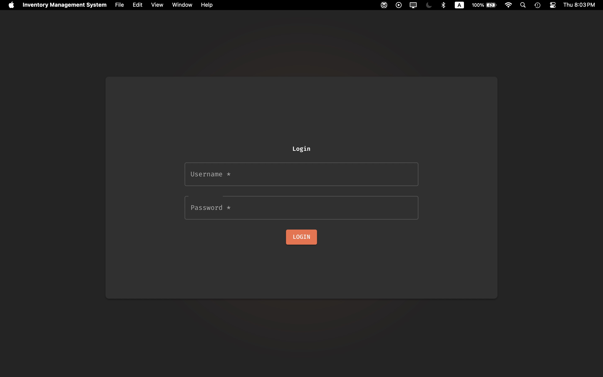
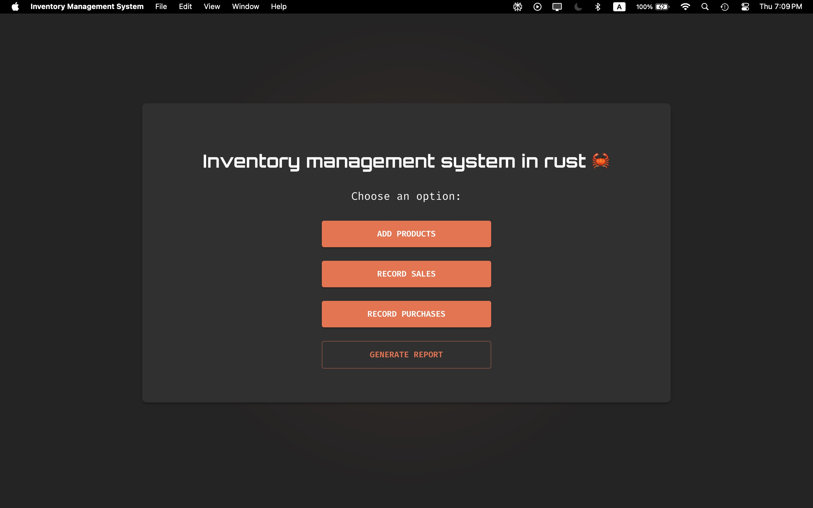
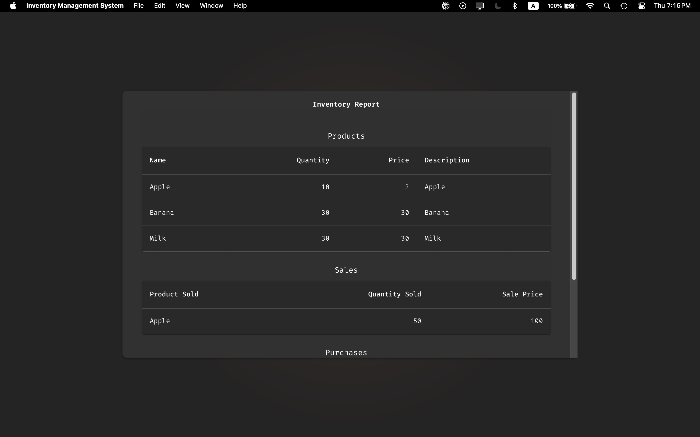
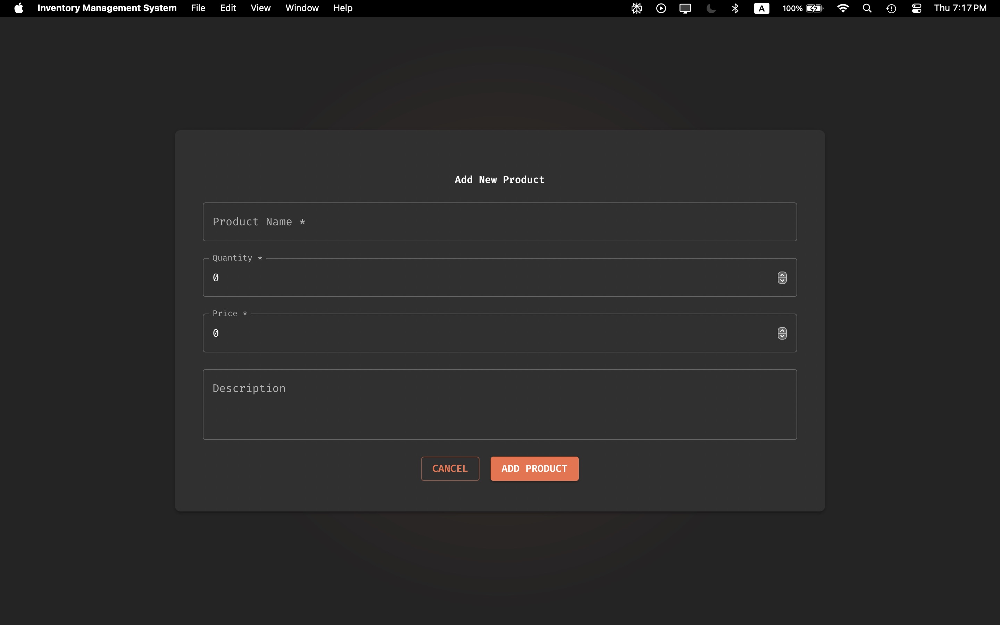

# Inventory Management System for Small Retail Store






This project is an **Inventory Management System (IMS)** built in Rust for managing a small retail store's **inventory**, **sales**, and **purchases**. It allows store managers to effectively track and control products, sales, and purchases while providing a simple text-based user interface.


📌 Important Setup Note: Data Storage Configuration
JSON Data File Path
This app uses a local JSON file to persist inventory, sales, and purchase data.
You must specify the full path to both inventory json file and users file in your environment variables:

Create a .env file in the project root with:

ini
Copy
DATA_FILE_PATH=/path/to/your/data.json
Example (Linux/macOS):

ini
Copy
DATA_FILE_PATH=/home/user/inventory_data/data.json
Example (Windows):

ini
Copy
DATA_FILE_PATH=C:\Users\YourName\inventory_data\data.json
The app will automatically:

Create the file if it doesn’t exist.

Read/write data to this location.

Cloud Database Recommendation
While the app works with local JSON storage, for production environments we strongly recommend using a cloud database (e.g., PostgreSQL, Firebase, or MongoDB) due to:

Better reliability: No risk of local file corruption.

Multi-user access: Safe concurrent writes.

Scalability: Handles larger datasets efficiently.

## Features

### 1. **Inventory Management**
   - Add, edit, and delete products from the store's inventory.
   - Each product contains:
     - **Name**
     - **Description**
     - **Price**
     - **Quantity**

### 2. **Sales Management**
   - Record sales transactions, including:
     - Product sold
     - Quantity sold
     - Sale price
   - Automatically calculates and displays:
     - Total sales for the transaction
     - Profit made from each transaction

### 3. **Purchase Management**
   - Record purchase transactions, including:
     - Product purchased
     - Quantity purchased
     - Purchase price
   - Automatically calculates and displays:
     - Total cost of each purchase

### 4. **Reporting**
   - Generate user-friendly text-based reports, including:
     - Store's current inventory
     - Sales transaction history
     - Purchase transaction history
   - Reports are structured in clear, easy-to-read tables or lists.

### 5. **Error Handling**
   - Robust error handling capabilities, including:
     - Invalid inputs
     - Out-of-stock items
     - Incorrect product information

### 6. **Security**
   - Basic authentication for store managers to ensure only authorized personnel can access and modify inventory, sales, and purchase data.

### 7. **User Interface**
   - Text-based user interface for ease of navigation.
   - Allows store managers to easily perform tasks such as adding products, recording sales/purchases, and generating reports.

---

## Installation

### Prerequisites
- Rust installed on your system. If you don't have it, follow the instructions on the [official Rust website](https://www.rust-lang.org/learn/get-started).

### Steps to Install

1. Clone this repository to your local machine:
   ```bash
   git clone https://github.com/yourusername/ims-retail-store.git
   cd ims-retail-store
   ```

2. Build and run the project:
   ```bash
   cargo build
   cargo run
   ```

---

## Usage

Once the application is running, you will be presented with a text-based menu that allows you to choose from various options like:

- **Manage Inventory**: Add, edit, or delete products.
- **Record Sales**: Log sales transactions and view sales history.
- **Record Purchases**: Log purchase transactions and view purchase history.
- **Generate Reports**: View detailed reports on inventory, sales, and purchases.

### Sample Menu:
```plaintext
Welcome to the Inventory Management System!
Please choose an option:
1. Manage Inventory
2. Record Sales
3. Record Purchases
4. Generate Reports
5. Exit
```

### Example Commands:
- Add product:
  ```plaintext
  Name: Apple
  Description: Fresh red apples
  Price: 0.99
  Quantity: 100
  ```

- Record sale:
  ```plaintext
  Product: Apple
  Quantity Sold: 2
  Sale Price: 1.50
  ```

---

## Design and Architecture

This system is designed in Rust with an emphasis on simplicity and efficiency:

- **Data Structures**: Products, sales, and purchases are managed using Rust's structs and enums.
- **Error Handling**: Uses Rust's `Result` and `Option` types for robust error management.
- **Security**: Basic username and password authentication system for store managers.
- **Persistence**: (Optional) Integrate file I/O or a database to persist inventory, sales, and purchase data.

---

## Future Enhancements

- **Persistent Storage**: Store data in files or a database to ensure the data is saved across sessions.
- **Advanced Security**: Implement encryption for sensitive data like manager credentials.
- **Graphical User Interface (GUI)**: Upgrade the text-based UI to a GUI for better user experience.
- **Online Store Integration**: Connect the IMS with an online retail platform for tracking both online and physical sales.

---